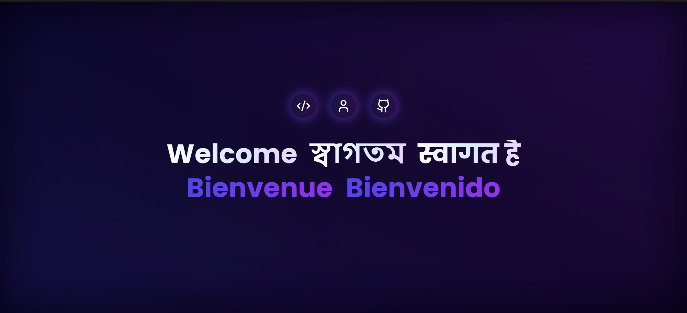
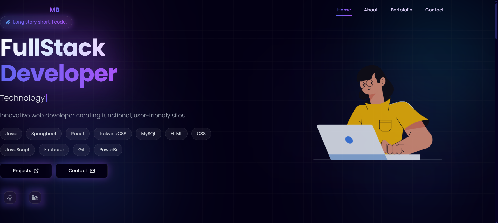
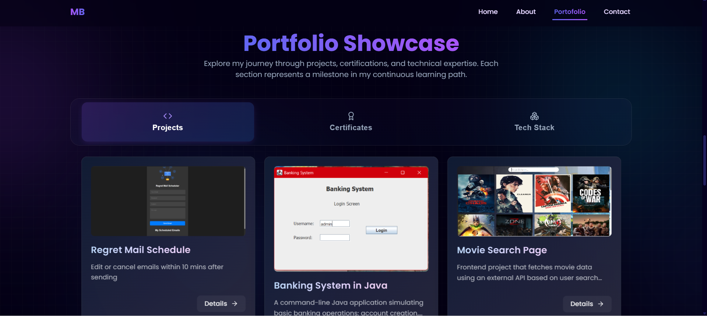
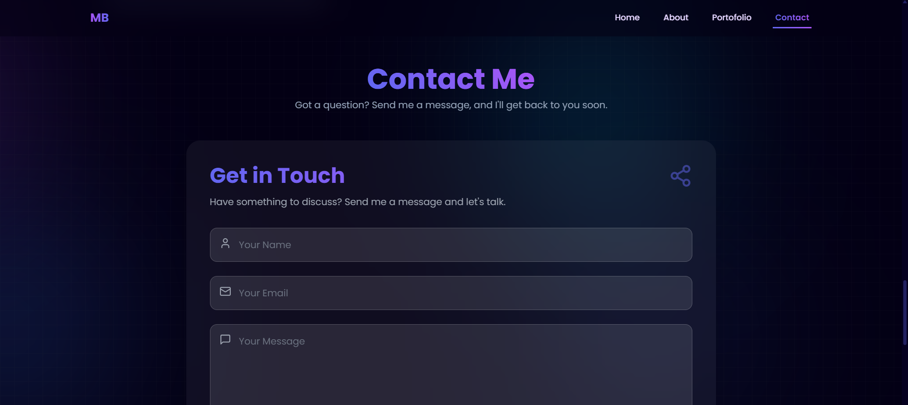

# 🌐 Manishita Biswas – Personal Portfolio

Welcome to my personal portfolio website! Built with modern web technologies, this site showcases my work, skills, and creative projects as a frontend developer focused on interactive design and immersive UI experiences.

## 🛠️ Tech Stack

- **Framework:** [React](https://react.dev/)
- **Build Tool:** [Vite](https://vitejs.dev/)
- **Styling:** [Tailwind CSS](https://tailwindcss.com/), [MUI](https://mui.com/)
- **Animation:** [Framer Motion](https://www.framer.com/motion/), [GSAP](https://gsap.com/)
- **Other Libraries:**
  - `lucide-react` for icons
  - `firebase` for backend integrations
  - `sweetalert2`, `react-intersection-observer`, `typewriter-effect`, and more

##  Features

-  Fast and responsive SPA
- Smooth animations and transitions
- Dynamic project showcase
- Mobile-first design
- Firebase integration


### Loading Page  


###  Home Page  


### Portfolio Page  


###  Contact Page  


##  Getting Started

To run the project locally:

```bash
# Clone the repo
git clone https://github.com/imanishita/ManishitaBiswas.git

# Navigate into the project directory
cd ManishitaBiswas

# Install dependencies
npm install --legacy-peer-deps

# Start development server
npm run dev
